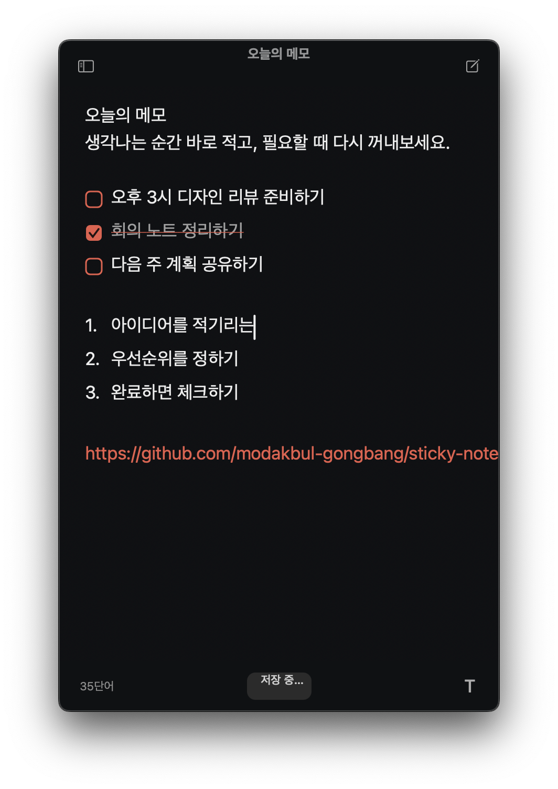
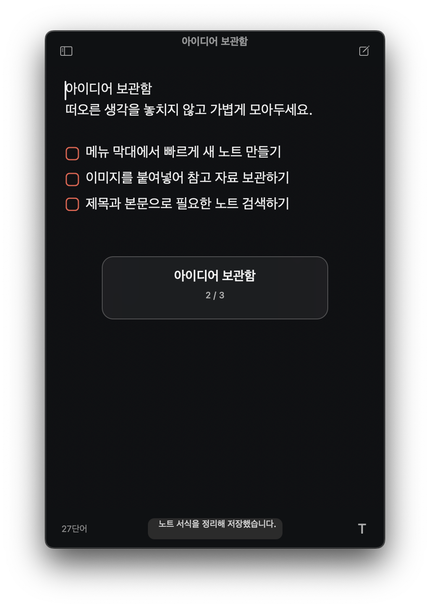
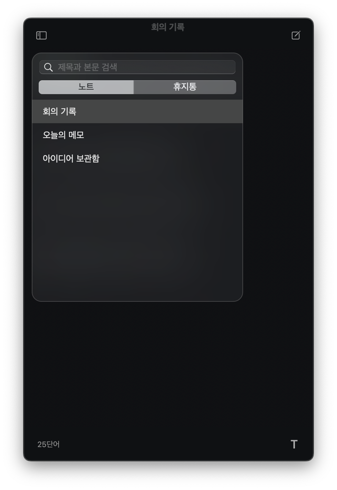

# Sticky Notes

개인 Mac에서 `Option+\``로 꺼내 쓰는 로컬 전용 AppKit 스티키 노트 앱입니다.
노트 수에 제품 제한을 두지 않으며 서식과 이미지를 RTFD 패키지로, 검색 메타데이터를 원자적 JSON 인덱스로 Application Support에 저장합니다.

<p align="center">
  
</p>

## 주요 기능

- `Option+\``로 어디서든 노트를 열고 숨깁니다.
- `Control+Tab`과 `Control+Shift+Tab`으로 노트를 빠르게 전환합니다.
- 체크리스트, 불릿, 번호 목록, 링크, 굵게, 이미지 붙여넣기를 지원합니다.
- 노트와 휴지통을 한 화면에서 검색하고 관리합니다.
- 모든 노트는 이 Mac에만 저장됩니다.

| 빠른 노트 전환 | 노트 검색과 관리 |
| --- | --- |
|  |  |

## 빌드와 설치

```sh
swift test
./scripts/install-app.sh
```

설치 결과는 `/Applications/Sticky Notes.app`이며 앱 콘텐츠는 `~/Library/Application Support/Sticky Notes/`에 남습니다.
앱은 네트워크 권한, 분석, 충돌 보고, 업데이트 확인을 포함하지 않습니다.

## 단축키 이전

앱은 Carbon으로 `Option+\`` 등록을 시도하고 실제 OSStatus를 화면에 표시합니다.
Raycast Notes가 이미 단축키를 쓰는 경우 Raycast의 보이는 설정 화면에서 Notes 단축키 하나만 해제한 뒤 메뉴 막대의 단축키 상태를 눌러 다시 시도합니다.
Raycast의 내부 데이터베이스나 암호화된 설정은 읽거나 수정하지 않습니다.

이전 작업 중 새 앱 등록이 실패하면 같은 보이는 Raycast 설정 화면에서 캡처해 둔 원래 키 조합을 다시 지정합니다.
다른 Raycast 설정은 변경하지 않습니다.
